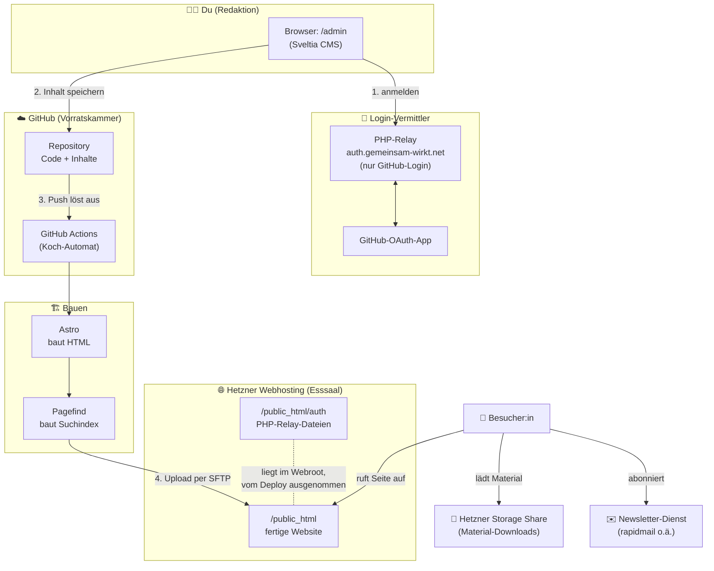

# Wie die Website funktioniert – Überblick für die Redaktion

Diese Seite erklärt **ohne Technik-Vorwissen**, wie unsere Website aufgebaut ist und
welche Teile zusammenspielen. Du musst davon **nichts auswendig können**, um Inhalte zu
pflegen — aber es hilft zu verstehen, *was* passiert, wenn du auf „Speichern“ klickst.

---

## Das Bild in einem Satz

> Unsere Website ist **fertig gebackenes** HTML. Es gibt **keine Datenbank** und keinen
> „laufenden“ Server, der bei jedem Besuch etwas berechnet. Wenn du Inhalte änderst,
> wird die Seite **einmal neu gebacken** und das Ergebnis aufs Hosting gelegt.

Das macht die Seite schnell, sicher und extrem wartungsarm.

---

## Eine Analogie: das Kochbuch

- **Astro** ist die **Küche**: Aus Zutaten (deinen Texten) und Rezepten (dem Design)
  kocht sie fertige Gerichte (HTML-Seiten).
- **GitHub** ist die **Vorratskammer**: Hier liegen alle Zutaten und Rezepte ordentlich
  versioniert. Nichts geht verloren, jede Änderung ist nachvollziehbar.
- **Sveltia CMS** ist die **Bestell-App**: Du gibst Zutaten ein, ohne die Küche betreten
  zu müssen. Deine Eingaben wandern automatisch in die Vorratskammer.
- **GitHub Actions** ist der **Koch-Automat**: Sobald sich in der Vorratskammer etwas
  ändert, kocht er automatisch neu und stellt das Essen auf den Tisch.
- **Hetzner Webhosting** ist der **Tisch / Esssaal**: Hier sehen die Gäste (Besucher)
  das fertige Essen (die Website).
- Der **PHP-Login-Vermittler** ist der **Türsteher** der Bestell-App: Er prüft per
  GitHub, ob du reindarfst — und reicht sonst nichts weiter.

---

## Die Architektur als Diagramm



> Falls das Diagramm bei dir nicht als Grafik erscheint (z. B. in einem einfachen
> Text-Editor), nutze die ASCII-Version weiter unten.

---

## Dasselbe als ASCII-Skizze

```
                          ┌──────────────────────────────┐
       DU (Redaktion)     │  Browser:  /admin (Sveltia)  │
                          └───────┬───────────────┬──────┘
                  1. Login        │               │  2. Inhalt speichern
                                  ▼               ▼
                    ┌───────────────────┐   ┌──────────────────────┐
                    │  PHP-Login-Relay  │   │   GitHub-Repository  │
                    │ auth.<domain>     │   │  (Code + Inhalte)    │
                    │  ⇄ GitHub-OAuth   │   └──────────┬───────────┘
                    └───────────────────┘              │ 3. Push startet
                                                       ▼
                                            ┌──────────────────────┐
                                            │   GitHub Actions     │
                                            │  Astro baut HTML  +  │
                                            │  Pagefind-Suchindex  │
                                            └──────────┬───────────┘
                                                       │ 4. Upload (SFTP)
                                                       ▼
   ┌───────────────┐                        ┌──────────────────────────┐
   │ Storage Share │ ◀── Material ───       │  HETZNER /public_html    │
   │ (Downloads)   │                        │  fertige Website         │
   └───────────────┘                        │   └ /auth  (PHP-Relay)   │
                                            └────────────┬─────────────┘
   ┌───────────────┐                                     │
   │ Newsletter-   │ ◀── Anmeldung ──                    ▼
   │ Dienst (ESP)  │                              👀 Besucher:innen
   └───────────────┘
```

---

## Die Bausteine im Klartext

### 🏗️ Astro – baut die Website
Nimmt unsere Texte und das Design und erzeugt daraus fertige HTML-Seiten. Läuft **nicht**
dauerhaft, sondern nur beim „Backen“ (Build). Ergebnis ist ein Ordner mit fertigen Dateien.

### 🧑‍💻 Sveltia CMS – die Redaktions-Oberfläche (`/admin`)
Deine Arbeitsumgebung. Hier legst du Veranstaltungen, News, Projekte und Podcast-Folgen an.
Du arbeitest in Formularen, **ohne Code zu sehen**. Beim Speichern schreibt Sveltia deine
Eingaben direkt nach GitHub.

### 🔐 PHP-Login-Vermittler – der Türsteher
Ein winziges Programm auf der Subdomain `auth.gemeinsam-wirkt.net`. Seine **einzige**
Aufgabe: beim Anmelden prüfen, ob du ein berechtigter GitHub-Nutzer bist. Er sieht oder
verändert **keine Inhalte**. Nötig, weil ein geheimer Schlüssel (Secret) niemals im
Browser landen darf.

### ☁️ GitHub – die Vorratskammer & das Gedächtnis
Speichert **alles**: Design, Inhalte, Einstellungen — und jede einzelne Änderung mit
Zeitstempel und Urheber. Dadurch ist **kein separates Backup** der Inhalte nötig, und man
kann jederzeit zu einem früheren Stand zurück.

### 🤖 GitHub Actions – der Automat
Bemerkt jede Änderung in GitHub, lässt Astro neu bauen, erzeugt den Suchindex und lädt das
Ergebnis automatisch zu Hetzner hoch. **Du musst nichts manuell hochladen.**

### 🔎 Pagefind – die Suche
Erstellt nach dem Bauen einen Suchindex über alle Seiten. Die Suche läuft **komplett im
Browser** der Besucher — kein Suchserver, keine Kosten, kein Datenschutzproblem.

### 🌐 Hetzner Webhosting – der Esssaal
Liefert die fertige Website an die Besucher aus (Ordner `/public_html`). Inklusive Domain,
E-Mail und SSL-Zertifikat (das Schloss-Symbol im Browser). EU-Anbieter, DSGVO-freundlich.

### 📁 Hetzner Storage Share (Nextcloud) – die Datei-Ablage
Für **Material und Downloads**. Der Verein lädt Dateien selbst hoch und teilt öffentliche
Links. Eine neue Datei braucht **kein** neues Website-Deployment.

### ✉️ Newsletter-Dienst (ESP) – extern
Der Newsletter läuft vollständig über einen EU-Dienst (z. B. rapidmail). Die Website bindet
nur das **Anmeldeformular** ein. Versand und Empfängerverwaltung passieren beim Dienst, nicht
auf unserer Seite.

---

## Zwei typische Abläufe

### Du pflegst einen Inhalt
1. Du öffnest `https://gemeinsam-wirkt.net/admin/` und meldest dich mit GitHub an.
2. Du füllst ein Formular aus (z. B. neue Veranstaltung) und klickst **Speichern/Veröffentlichen**.
3. Sveltia legt das in GitHub ab. → GitHub Actions startet automatisch.
4. Nach 1–2 Minuten ist die neue Veranstaltung **live** auf der Website.

### Eine Besucherin schaut sich um
1. Sie ruft die Website auf → Hetzner liefert sofort fertiges HTML aus (sehr schnell).
2. Sucht sie etwas, läuft die Suche **in ihrem Browser** (Pagefind).
3. Lädt sie Material, kommt das aus dem Storage Share.
4. Abonniert sie den Newsletter, landet sie beim Newsletter-Dienst.

---

## Was das für dich bedeutet

✅ **Du brauchst nur eines zu können:** dich bei `/admin` anmelden und Formulare ausfüllen.
✅ Alles andere passiert **automatisch**.
✅ Du kannst **nichts kaputt machen**, was sich nicht rückgängig machen ließe (GitHub merkt sich alles).
⚠️ Was **nicht** über `/admin` läuft (Design ändern, neue Seitentypen, Technik), macht der
technische Vorstand direkt am Code.

Konkrete Zuständigkeiten und Routinen: siehe [`pflege-aktivitaeten.md`](./pflege-aktivitaeten.md).
